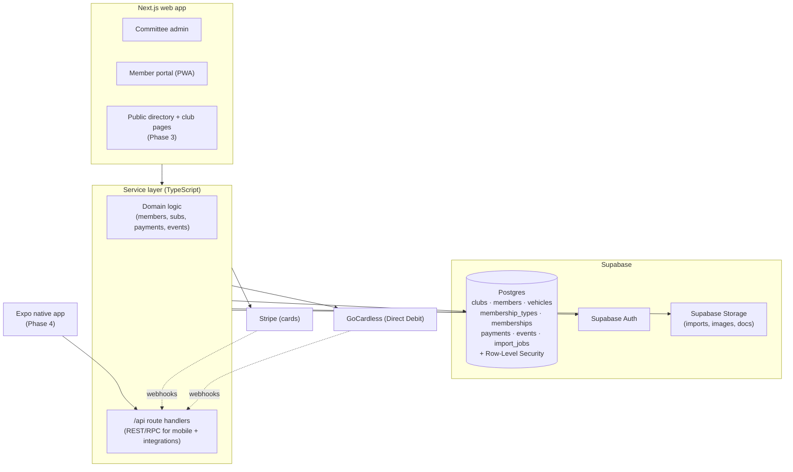
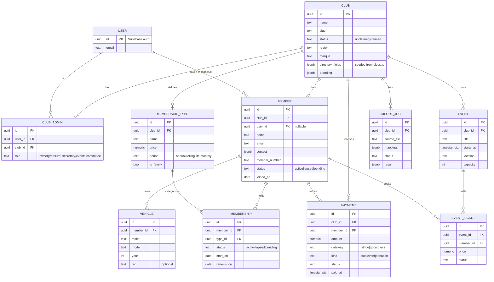
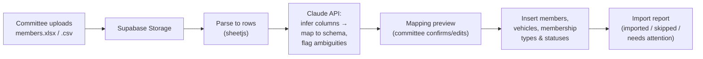
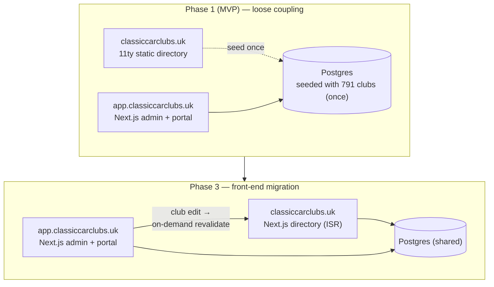

# Club Ops Platform — Architecture Design

**Date:** 2026-06-06
**Status:** Draft for review
**Author:** James Williams (with Claude)
**Repo:** `/Users/james/Desktop/CLASSICCC` (existing 11ty directory site)

---

## 1. Summary

Build a SaaS product for **UK classic car club committees**: a modern, self-serve,
all-in-one membership and operations platform, sold through the existing
`classiccarclubs.uk` directory as its distribution channel.

The product launches at `app.classiccarclubs.uk` as a separate Next.js
application. The existing 11ty directory site stays as-is initially and is
migrated into the platform in a later phase. The end state is a single platform
serving several surfaces (public directory, committee admin, member portal, and
eventually a native mobile app) from one backend.

This document covers architecture and the phased migration plan. It does **not**
cover detailed UI design or the implementation plan (those follow).

---

## 2. Context & rationale

- **The asset:** an existing directory of 791 UK classic car clubs (795 static
  pages) with SEO traffic, plus a web-design service channel already selling to
  clubs. Google's AI Overview already cites `classiccarclubs.uk` for
  "classic car clubs software uk".
- **The market:** validated but sleepy. Competitors (CROSSMEMBER, sheepCRM,
  myClubhouse, VeryConnect) exist but are weak: tiny review footprints, dated
  UX, consultative onboarding, and split between cheap-but-bare (CROSSMEMBER,
  ~£200/yr, no events/app/website) and pricey-but-generic (sheepCRM, £3k+/yr,
  consultative). The **modern, self-serve, car-native, mid-priced
  (£400–£1,200/yr) middle is unoccupied.**
- **The wedge:** "the modern, all-in-one car-club platform you set up yourself
  in an afternoon, because the AI imports your messy spreadsheet for you."
  Switching inertia (not competitor quality) is the real moat; AI-powered
  migration is the unclaimed feature that neutralises it.
- **Honest scale:** low thousands of UK car clubs at ~£400–£1,200/yr each. A
  strong result is tens-to-low-hundreds of thousands ARR, run at very low cost
  by one builder plus AI. This is a high-margin niche business, not a
  venture-scale play. Win on distribution and low cost-to-serve.

### Prior art / lesson
A previous community product ("The Frost Hub", 2018–19) reached ~1,000 members
then died: branded by an ecommerce store, mis-positioned, and built
feature-first (feed + forum + listings) without distribution or a single-payer
focus. The lessons baked into this design: **start with a B2B payer (the
committee), ship one wedge not a feature pile, and lean on owned distribution.**

---

## 3. Goals & non-goals

### Goals
- A committee can sign up, import their existing member spreadsheet via AI, and
  be collecting subs online within an afternoon.
- A clean per-club multi-tenant data model with strong isolation.
- An architecture that supports an eventual native mobile app **without a
  rewrite** (API-first).
- A path to fold the existing public directory into the platform so club edits
  flow live to public pages, plus member-only public routes.

### Non-goals (now)
- Native mobile app build (architecture supports it; build deferred to Phase 4).
- Community/feed/forum layer (deferred to Phase 4; this is the romantic layer
  that must not be built first).
- Migrating the 11ty directory front-end in v1 (deferred to Phase 3).
- Competing for the large prestige marque clubs sheepCRM holds; start with the
  under-served 50–500-member clubs the directory already reaches.

---

## 4. Surfaces & domains

| Surface | Domain | Auth | Phase 1 tech | End-state tech |
|---|---|---|---|---|
| Marketing + public directory | `classiccarclubs.uk` | Public | 11ty (static) | Next.js (ISR) |
| Per-club public page | `classiccarclubs.uk/club/...` | Public | 11ty (static) | Next.js (ISR, DB-driven) |
| Committee admin | `app.classiccarclubs.uk` | Committee | Next.js | Next.js |
| Member portal | `app.classiccarclubs.uk` | Member (PWA) | Next.js | Next.js |
| Member-only public routes | `classiccarclubs.uk/...` | Member | n/a | Next.js (Phase 3) |
| Native mobile | app stores | Member/committee | n/a | Expo (Phase 4) |

---

## 5. High-level architecture (end-state)

**Principle — API-first.** All business logic lives in the service layer, called
both by Next.js server components/actions and by `/api` route handlers. The web
app and the future mobile app are both *clients* of the same logic. Nothing
club-critical is trapped inside page components.

---

## 6. Tech stack

| Concern | Choice | Why |
|---|---|---|
| Web framework | **Next.js (App Router)** | SSR/ISR for SEO-critical public pages, server actions for admin, one codebase for all web surfaces. |
| Database | **Supabase Postgres** | Relational fit for members/subs/payments; row-level security gives clean multi-tenancy. |
| Auth | **Supabase Auth** | Magic-link + password; integrates with RLS; supports member + committee personas. |
| File/image storage | **Supabase Storage** | Spreadsheet uploads for migration, club/member images, documents. |
| Card payments | **Stripe** | Already partially wired; best UX for one-off and card subs. |
| Direct Debit | **GoCardless** | UK clubs strongly prefer DD for annual subs; lower fees; reduces failed renewals. |
| AI migration | **Claude API** | Parse/clean/map arbitrary member spreadsheets to the schema. |
| Email | Transactional via existing SendGrid; bulk comms TBD in v1.1 | Reuse what exists; defer bulk. |
| Hosting | **Vercel** (matches current deploy) | Existing familiarity; ISR + on-demand revalidation support. |
| Mobile (Phase 4) | **Expo / React Native** | Single API client; reuses the service layer. |

---

## 7. Core data model

Notes:
- `EVENT` / `EVENT_TICKET` ship in v1.1, but the schema is defined now to avoid
  later churn.
- Every tenant-scoped table carries `club_id` for RLS.

---

## 8. Multi-tenancy, auth & roles

- **Tenant = club.** Row-Level Security policies restrict every tenant table by
  `club_id`. A committee admin can read/write only clubs they administer; a
  member can read/write only their own records within their club.
- **Two personas, one identity.** A `USER` (Supabase Auth) may be a committee
  admin of one club and a member of another. Roles are expressed via
  `CLUB_ADMIN.role` (committee) and `MEMBER.user_id` (member portal access).
- **Member accounts are optional.** Imported members exist without a `user_id`;
  they are invited via magic link to activate portal access. The club functions
  fully before any member logs in.
- **Claim flow.** "Claim your club" matches a committee user to an existing
  seeded `CLUB` record (status `unclaimed` → `claimed`), gating with a
  verification step (email on record / manual review).

---

## 9. The hero feature: AI spreadsheet migration

The single biggest adoption barrier in this market is migrating a club's existing
records. Incumbents treat it as a manual chore or paid consultancy. We make it a
one-step, self-serve flow.

- Handles arbitrary column names, merged tiers, vehicle data in free-text,
  inconsistent date formats.
- Always a **human-confirm step** before writing — the AI proposes the mapping;
  the committee approves it. Nothing is silently imported.
- `IMPORT_JOB` records the source, mapping, and result for auditability and
  re-runs.

---

## 10. Payments architecture

- **Stripe** for card payments (one-off and card-based subs).
- **GoCardless** for Direct Debit subs — the preferred renewal mechanism for UK
  clubs; reduces failed/forgotten renewals.
- Both write to a single `PAYMENT` table via **webhooks → `/api` handlers**, so
  the "who's paid / who's lapsed" view is always authoritative.
- **Money goes to the club's own connected account** (Stripe Connect /
  GoCardless), not pooled through us — mirrors CROSSMEMBER's trust messaging and
  avoids us holding client money.
- **Immediate fix (independent of this build):** the current live site has a
  Stripe *test-mode* link on the Showcase tier and no fulfilment. Disable or
  correct it so the live site is not silently broken.

---

## 11. Directory ↔ app integration (phased)

The requirement: club edits in the app should ultimately drive the public
directory page, and there should be member-only routes on the public site. The
plan reaches that **once**, cleanly, rather than building a throwaway bridge.

- **Phase 1:** import the 791 clubs from `src/_data/clubs.js` into Postgres as
  `unclaimed` records, once. The 11ty directory stays static and untouched. No
  live bridge. Claiming links a committee to its record.
- **Phase 3:** rebuild the public directory in Next.js, rendering club pages from
  Postgres via ISR with **on-demand revalidation** triggered when a committee
  edits public-facing fields. Member-only public routes live behind auth
  middleware in the same Next.js app. 11ty is retired (strangler pattern).
- After Phase 3, `classiccarclubs.uk` and `app.classiccarclubs.uk` are one
  platform on two domains, sharing the backend.

---

## 12. Mobile strategy

- **Now:** API-first service layer + ship the member portal as a **PWA**
  (installable, home-screen icon, web push — supported on iOS as of 2026). This
  delivers most of the "app" experience for minimal cost.
- **Phase 4:** native **Expo** app consuming the same `/api`, introduced
  alongside the community/engagement layer where a native app actually earns its
  place (feed, push, "the place"). Because logic is in the service layer, this is
  additive, not a rewrite.

---

## 13. Phased roadmap

| Phase | Scope | Beats |
|---|---|---|
| **v1 (MVP)** | AI migration · member + vehicle DB · subs/renewals (Stripe + GoCardless) · member portal (PWA) | The onboarding friction of every incumbent |
| **v1.1** | Events + paid ticketing, then comms/newsletter | CROSSMEMBER's missing feature categories |
| **Phase 3** | Migrate directory front-end into Next.js; DB-driven public club pages; member-only public routes | Generic competitors with no directory/distribution |
| **Phase 4** | Native mobile app + community/feed layer | The Hub vision, done right and on purpose |

---

## 14. Key risks & mitigations

| Risk | Mitigation |
|---|---|
| Switching inertia (clubs already on a tool) | AI migration as hero; target clubs still on spreadsheets first. |
| Small TAM | Low cost-to-serve (solo + AI), distribution via directory, high margin. Don't build for scale. |
| Data-loss / payment-continuity fear | Member money to clubs' own connected accounts; clear UK-hosting/security messaging; never silent imports. |
| Payments/renewals bugs erode trust | Treat Stripe/GoCardless webhooks + reconciliation as table-stakes quality; test hard. |
| Over-building (the Frost Hub trap) | Strict phasing; community layer is last, not first. |
| Custodian adds a club layer | Watch; consider partnership/integration rather than fighting their consumer base. |

---

## 15. Open questions

1. **Pricing exact points.** Direction agreed: transparent, per-member, premium
   over CROSSMEMBER, well under sheepCRM (~£1–£1.50/member/yr with sensible
   min/max). Exact tiers to confirm against a few real club sizes.
2. **House stack alignment.** Confirm Supabase vs any qubeOS standard stack.
3. **Validation step.** Which ~10 clubs from the directory to interview/show the
   spec to before building, and how (email via directory, calls).
4. **Claim verification.** How strict to make club-claim verification at launch
   (email-on-record vs manual review).

---

## 16. Next step

On approval of this architecture, proceed to a detailed **implementation plan**
(writing-plans) scoped to **v1 (MVP)** only.
